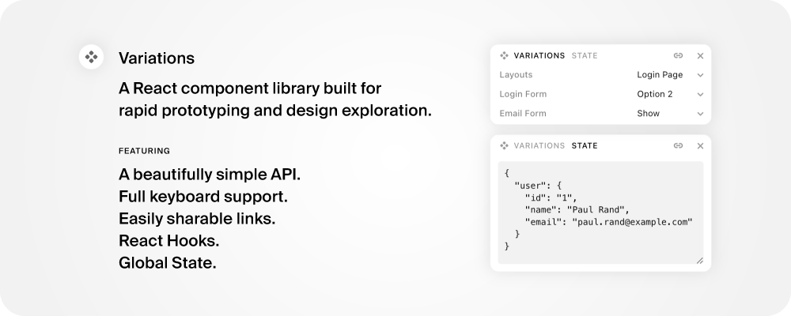

# Variations



A React component library that enables rapid prototyping and exploration of UI variations.

## Installation

```bash
npm install variations
# or
yarn add variations
# or
pnpm add variations
```

## Setup

### Provider and Controls Setup

Wrap your application with the `VariationsProvider` at the root level. The `VariationControls` component provides a UI for switching between different variations in your app. You can style it or position it as needed.:

```tsx
"use client";
import { VariationsProvider, VariationsControls } from "variations";

function RootLayout({ children }: { children: React.ReactNode }) {
  return (
    <VariationsProvider>
      {children}
      <VariationsControls position="bottom-center" />
    </VariationsProvider>
  );
}
```

By default, variations are saved to and loaded from the URL query string so that you can share variations with others. You can disable this behavior by setting `disableQueryString` to `true`:

```tsx
<VariationsProvider disableQueryString={true}>
  {children}
  <VariationsControls position="bottom-center" />
</VariationsProvider>
```

The URL query string uses a clean, readable format:

```
http://localhost:3000/?var=group.id_group.id_group.id&s=base64_encoded_state
```

For example:

```
http://localhost:3000/?var=root.login-page_login-form.option-2_email-form.show&s=eyJ0aGVtZSI6eyJwcmltYXJ5Q29sb3IiOiIjMDAwIn19
```

Where:

- `.` separates a group from its ID (e.g., `login-form.option-2`)
- `_` separates different variations (e.g., `login-form.option-2_email-form.show`)
- `s` contains the base64-encoded JSON of your global state

This format makes it easy to share not just variations but also the entire application state with others. The state is automatically synchronized with the URL, so you can:

- Share URLs that include both variations and state
- Use browser back/forward navigation to move through state history
- Bookmark specific states of your application

You can disable this behavior by setting `disableQueryString` to `true`:

```tsx
<VariationsProvider disableQueryString={true}>{children}</VariationsProvider>
```

Note for Next.js users: Variations requires the `"use client"` directive to be present in the root component.

## Usage

### Basic Example

```tsx
"use client";

import { Variations, Variation } from "variations";

export default function MyComponent() {
  return (
    <Variations label="Button Styles">
      <Variation label="Primary">
        <button className="bg-blue-500 text-white">Click me</button>
      </Variation>

      <Variation label="Secondary">
        <button className="bg-gray-500 text-white">Click me</button>
      </Variation>
    </Variations>
  );
}
```

### Nested Variations

You can create nested variations to explore combinations of different components:

```tsx
<Variations label="Layout">
  <Variation label="Sidebar">
    <div className="flex">
      <Variations label="Theme">
        <Variation label="Light">
          <div className="bg-white">{/* Content */}</div>
        </Variation>
        <Variation label="Dark">
          <div className="bg-gray-900">{/* Content */}</div>
        </Variation>
      </Variations>
    </div>
  </Variation>

  <Variation label="Top Nav">
    <div className="flex flex-col">{/* Similar nested variations */}</div>
  </Variation>
</Variations>
```

## API Reference

### VariationsProvider

The root component that manages a set of variations.

Props:

- `children`: React nodes containing Variation components
- `disableQueryString` (boolean, optional): When true, disables the URL query string functionality. This prevents variations from being saved to or loaded from the URL. Defaults to `false`

### Variations Component

The root component that manages a set of variations.

Props:

- `label` (string): The label for this set of variations
- `isRoot` (boolean, optional): When true, indicates this is the root variations component. Only one root component should exist in the tree. Defaults to `false`
- `children`: React nodes containing Variation components

### Variation Component

The component that wraps each variation.

Props:

- `label` (string): The display name for this variation
- `children`: React nodes to render when this variation is active

### Controls Component

A pre-built UI component that provides a control panel for managing variations.

Props:

- `position` (string, optional): The position of the control panel. Possible values are `bottom-center`, `bottom-left`, `bottom-right`, `middle-left`, `middle-right`, `top-center`, `top-left`, `top-right`. Defaults to `bottom-center`

The Controls component automatically displays all registered variations and allows users to switch between them. It updates in real-time as variations are added or removed from your app. You can show and hide the controls by clicking on the Variations icon or by using the keyboard shortcut `Option + v`. The controls support keyboard navigation or clicking on the controls to switch between variations.

### Hooks

#### useVariationsState

A hook for accessing and updating global state that lives alongside your variations. This state is independent of any specific variation and can be used to store any application-wide data. The hook follows React's useState pattern, returning a tuple of the state and a setter function.

```tsx
interface GlobalState {
  theme: {
    primaryColor: string;
    fontSize: number;
  };
  preferences: {
    showAdvancedOptions: boolean;
  };
}

// First, provide initial state through the provider
function App() {
  const initialState: GlobalState = {
    theme: {
      primaryColor: "#000000",
      fontSize: 16,
    },
    preferences: {
      showAdvancedOptions: false,
    },
  };

  return (
    <VariationsProvider initialState={initialState}>
      <YourApp />
    </VariationsProvider>
  );
}

// Then use the state anywhere in your app
function ThemeControls() {
  const [state, setState] = useVariationsState<GlobalState>();

  return (
    <div>
      {/* Direct value update */}
      <button
        onClick={() =>
          setState({
            ...state,
            theme: { ...state.theme, primaryColor: "#000000" },
          })
        }
      >
        Set Dark Theme
      </button>

      {/* Updater function */}
      <button
        onClick={() =>
          setState((prev) => ({
            ...prev,
            theme: { ...prev.theme, primaryColor: "#ffffff" },
          }))
        }
      >
        Set Light Theme
      </button>

      {/* Toggle with updater function */}
      <label>
        <input
          type="checkbox"
          checked={state.preferences.showAdvancedOptions}
          onChange={(e) => {
            setState((prev) => ({
              ...prev,
              preferences: {
                ...prev.preferences,
                showAdvancedOptions: e.target.checked,
              },
            }));
          }}
        />
        Show Advanced Options
      </label>
    </div>
  );
}
```

The global state feature provides:

- Familiar React useState-like API with support for both direct values and updater functions
- Type-safe state management with TypeScript
- Immutable state updates
- Access to state from anywhere in your app
- Independent of variations system
- Persists across variation changes
- Compact URL encoding for sharing

#### useVariation

A hook for managing a single variation group. This is the recommended way to programmatically interact with variations.

```tsx
const { active, setActive, variations } = useVariation("theme");

// active: { id: string; label: string } | null
// The currently active variation or null if none is selected
console.log(active?.label); // e.g. "Light Theme"

// variations: Array<{ id: string; label: string }>
// All available variations for this group
console.log(variations); // e.g. [{ id: 'light', label: 'Light Theme' }, ...]

// setActive: (id: string) => void
// Function to change the active variation
setActive("dark");
```

Example usage with a select element:

```tsx
function ThemeSelector() {
  const { active, setActive, variations } = useVariation("theme");

  return (
    <select
      value={active?.id || ""}
      onChange={(e) => setActive(e.target.value)}
    >
      {variations.map(({ id, label }) => (
        <option
          key={id}
          value={id}
        >
          {label}
        </option>
      ))}
    </select>
  );
}
```

#### useVariations

A lower-level hook that provides full access to the variations context. Use this if you need more control over variations or need to work with multiple groups at once.

```tsx
const {
  // Map of group IDs to their active variation IDs
  activeIds,

  // Function to set the active variation for a group
  setActiveId,

  // Map of all registered variations
  variations,

  // Tree representation of active variations
  activeTree,
} = useVariations();

// Example: Get active variation for a group
const activeThemeId = activeIds.get("theme");

// Example: Set active variation
setActiveId("theme", "dark");

// Example: Get all variations for a group
const themeVariations = Array.from(variations.entries()).filter(
  ([, variation]) => variation.group === "theme"
);
```

For TypeScript users, you can make the hook type-safe by providing group and ID types:

```tsx
type Groups = "theme" | "layout" | "typography";
type Ids = "light" | "dark" | "sidebar" | "topnav";

const { activeIds, setActiveId } = useVariations<Groups, Ids>();
// Now TypeScript will ensure you only use valid group and variation IDs
```

## Contributing

Contributions are welcome! Please feel free to submit a Pull Request.

## License

MIT © Dan Perrera

### State Management

The Variations library includes a built-in state management system that lives alongside your variations. This state is:

- Independent of your variations
- Globally accessible
- Type-safe with TypeScript
- Automatically synced to the URL (optional)

#### Basic Usage

```tsx
// First, define your state type (optional but recommended)
interface AppState {
  theme: {
    primaryColor: string;
    fontSize: number;
  };
  settings: {
    showAdvancedFeatures: boolean;
  };
}

// Initialize the state in your root component
function App() {
  const initialState: AppState = {
    theme: {
      primaryColor: "#000000",
      fontSize: 16,
    },
    settings: {
      showAdvancedFeatures: false,
    },
  };

  return (
    <VariationsProvider initialState={initialState}>
      <YourApp />
    </VariationsProvider>
  );
}

// Then use the state anywhere in your app
function ThemeControls() {
  const { state, setState } = useVariationsState<AppState>();

  // Read from state
  const { primaryColor, fontSize } = state.theme;

  // Update a single value
  const updateColor = (color: string) => {
    setState((prev) => ({
      ...prev,
      theme: {
        ...prev.theme,
        primaryColor: color,
      },
    }));
  };

  // Update multiple values at once
  const updateTheme = (color: string, size: number) => {
    setState((prev) => ({
      ...prev,
      theme: {
        ...prev.theme,
        primaryColor: color,
        fontSize: size,
      },
    }));
  };

  return (
    <div>
      <input
        type="color"
        value={primaryColor}
        onChange={(e) => updateColor(e.target.value)}
      />
      <input
        type="number"
        value={fontSize}
        onChange={(e) => updateTheme(primaryColor, Number(e.target.value))}
      />
    </div>
  );
}
```

#### URL Synchronization

The state is automatically synchronized with the URL, making it easy to share specific states:

```tsx
// This URL includes both variations and state
//localhost:3000/?var=theme.dark&state=%7B%22theme%22%3A%7B%22primaryColor%22%3A%22%23000%22%7D%7D

// You can disable URL synchronization if needed
http: <VariationsProvider disableQueryString={true}>
  <YourApp />
</VariationsProvider>;
```

#### Using with React Context

The state management works great alongside React's Context API:

```tsx
// Create a custom hook that combines variations state with context
function useTheme() {
  const { state, setState } = useVariationsState<AppState>();

  const updateTheme = useCallback(
    (color: string) => {
      setState((prev) => ({
        ...prev,
        theme: {
          ...prev.theme,
          primaryColor: color,
        },
      }));
    },
    [setState]
  );

  return {
    primaryColor: state.theme.primaryColor,
    updateTheme,
  };
}

// Use it in your components
function ThemeButton() {
  const { primaryColor, updateTheme } = useTheme();

  return <button style={{ backgroundColor: primaryColor }}>Click Me</button>;
}
```

#### Best Practices

1. Define your state type with TypeScript for better type safety
2. Use the updater function pattern to modify state
3. Create custom hooks for common state operations
4. Keep state updates immutable
5. Consider disabling URL sync for sensitive data
