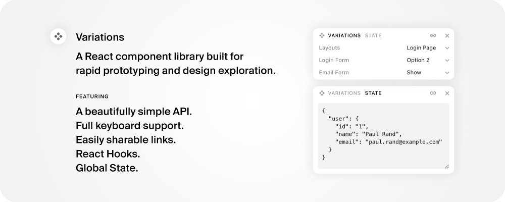

Rapid UI prototyping for React — keep multiple design options in the tree and switch between them live. Works with **Next.js App Router**, Vite, and other React apps. See [AGENTS.md](./AGENTS.md) for agent-oriented setup.

## Install

```bash
npm install variations
# peerDependencies: react >= 18, react-dom >= 18
```

## Quick start (Next.js App Router)

Keep `app/layout.tsx` as a Server Component. Put the provider in a small client file:

```tsx
// app/providers.tsx
"use client";

import { VariationsProvider, VariationsControls } from "variations";

export function Providers({ children }: { children: React.ReactNode }) {
  return (
    <VariationsProvider>
      {children}
      <VariationsControls position="bottom-center" />
    </VariationsProvider>
  );
}
```

```tsx
// app/layout.tsx
import { Providers } from "./providers";

export default function RootLayout({
  children,
}: {
  children: React.ReactNode;
}) {
  return (
    <html lang="en">
      <body>
        <Providers>{children}</Providers>
      </body>
    </html>
  );
}
```

Then author options in any Client Component:

```tsx
"use client";

import { Variations, Variation } from "variations";

export default function Hero() {
  return (
    <Variations label="Hero">
      <Variation label="Centered">
        <section className="text-center">…</section>
      </Variation>
      <Variation label="Split">
        <section className="grid md:grid-cols-2">…</section>
      </Variation>
    </Variations>
  );
}
```

Toggle the controls with **⌥V** (Option/Alt + V), or click the floating icon.

### Vite / SPA

```tsx
import { VariationsProvider, VariationsControls } from "variations";

export function App() {
  return (
    <VariationsProvider>
      <YourApp />
      <VariationsControls position="bottom-center" />
    </VariationsProvider>
  );
}
```

## URL sharing

Active variations (and optional global state) sync to the query string by default:

```
/?var=root.login-page_login-form.option-2&s=base64_encoded_state
```

- `.` separates group from variation id
- `_` separates groups
- `s` is base64 JSON for `useVariationsState`

Disable with:

```tsx
<VariationsProvider disableQueryString>{children}</VariationsProvider>
```

## Nested variations

```tsx
<Variations label="Layout" isRoot>
  <Variation label="Sidebar">
    <Variations label="Theme">
      <Variation label="Light">…</Variation>
      <Variation label="Dark">…</Variation>
    </Variations>
  </Variation>
  <Variation label="Top Nav">…</Variation>
</Variations>
```

## API

### `VariationsProvider`

| Prop | Type | Default | Description |
| --- | --- | --- | --- |
| `children` | `ReactNode` | — | App tree |
| `disableQueryString` | `boolean` | `false` | Disable URL sync |
| `initialState` | `TState` | — | Seed for `useVariationsState` |

### `Variations`

| Prop | Type | Default | Description |
| --- | --- | --- | --- |
| `label` | `string` | — | Group label in the controls |
| `isRoot` | `boolean` | `false` | Mark the top-level group (`group` id `root`) |
| `children` | `ReactNode` | — | `Variation` nodes (and nested `Variations`) |

### `Variation`

| Prop | Type | Description |
| --- | --- | --- |
| `label` | `string` | Option label |
| `children` | `ReactNode` | Rendered when active |

### `VariationsControls`

| Prop | Type | Default |
| --- | --- | --- |
| `position` | `"bottom-center"` \| `"bottom-left"` \| `"bottom-right"` \| `"middle-left"` \| `"middle-right"` \| `"top-center"` \| `"top-left"` \| `"top-right"` | `"bottom-right"` |
| `minimizedByDefault` | `boolean` | `false` |

### Hooks

**`useVariation(group)`** — preferred for one group:

```tsx
const { active, setActive, variations } = useVariation("theme");
setActive("dark");
```

**`useVariations()`** — full context (`activeIds`, `setActiveId`, `variations`, `activeTree`).

**`useVariationsState<T>()`** — React `useState`-like global state, URL-synced unless disabled:

```tsx
const [state, setState] = useVariationsState<AppState>();
setState((prev) => ({ ...prev, theme: { ...prev.theme, primaryColor: "#000" } }));
```

## Next.js notes

1. The published package entry starts with `"use client"` so Next treats it as a Client Component module.
2. Never force the root layout to be a Client Component — use `app/providers.tsx`.
3. Any file that *calls* hooks from this library (or renders interactive variations without a client parent) still needs `"use client"`.
4. `react` and `react-dom` are peer dependencies; the app must provide them (avoids duplicate-React failures).

## License

MIT © Dan Perrera
